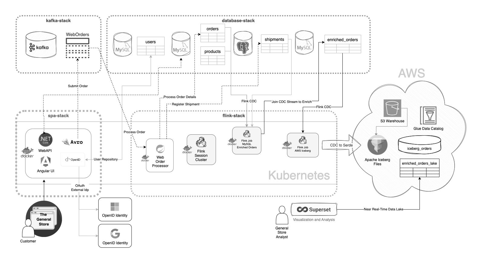

# SPA Stack
A collection of interoperable `frontends` and `backends` for delivering dockerized SPA web applications.

THe `backend` REST API frameworks chosen are `C# .NET Core 8.0 WebApi`, `SpringBoot REST` and `ExpressJS`.

The `frontend` SPA frameworks chosen are `Angular`, `React Typescript` and `VanillaJS`, for contrast and variety.

The development environment comes with the codebase in the form of a `devcontainer`, with an out-of-the-box _everything you need to start coding_ approach. Batteries included.

By using `VSCode` as the IDE, the `devcontainer` will build a development environment with all the required dependencies and SDK/JDKs for working with the projects in this `spa-stack`.  

## Requirements

- [Docker Desktop](https://www.docker.com/products/docker-desktop/) 
- [git](https://git-scm.com)
- [Visual Studio Code](https://code.visualstudio.com)

## The REST API Backends
All located in the [api](api) folder.

1. [C# .NET Core 8.0 WebApi](api/WebAPI/)
2. [Spring Boot 5 REST+](api/springboot/)
2. [ExpressJS](api/express/)

Objective is to implement the same backend API, such that the front-ends can interchange backends, and visa versa. 

> As of this writing the `Angular + WebAPI` is mostly functional and serves as the baseline and initial implementation.

All `backends` are hosted on `https://localhost:8090`.

## The SPA Frontends
All located in the [ui](ui) folder.

1. [Angular 18](ui/angular/)
2. [React TS](ui/react/)
3. [VanillaJS](ui/vanilla/)

Each of these will implement a slightly different UI approach to the standardized API backend.

All `frontends` are hosted on `https://localhost:4200`.

## Context and Concept: The General Store
The following diagram outlines the broader concept implemented across the three projects of: [database-stack](https://github.com/seanhig/database-stack), [flink-stack](https://github.com/seanhig/flink-stack) and [spa-stack](https://github.com/seanhig/spa-stack).



Initially a simple `flink` example of change data capture and stream processing, the example has been extended with various components that would make up a real world flow. 

The [spa-stack]() provides the customer facing store front web application. The `flink-stack`, and the components developed within as examples, handle the `back office` aspects of the system using stream processing and change data capture to enable near real-time data lakes from the incoming order information.  The `flink-stack` also includes a `web order generator` to simulate high volume intake.

The `spa-stack` leverages the `flink-stack` examples to explore relevant aspects of a modern SPA application operating in a high volume and scalable architecture.  

The end result is a an example application that spans a number of projects and serves as a reference and scaffolding.

__The General Store__ overall practically demonstrates the following concepts:

- OAuth2 OpenID Connect Authentication w/ SPA Front End
- RDBMS Persistence via declarative ORM in the API layer
- Decoupling high volume intake sources using Apache Kafka and messaging.
- The use of AVRO Serde for intake, and Iceberg Serde for upsertable data lake
- Change Data Capture streaming and stream processing
- Apache Flink's ability to execute SQL JOIN and aggregation semantics cross-system
- Apache Flink / Iceberg integration for near real-time Serde based Data Lake updates
- Containerization and Orchestration

> It also provides scaffolding and example code to bootstrap real world initiatives, and serves as a set of notes, as there are a lot of complex moving parts - ever evolving and changing.

## Setup

To make use of the `spa-stack`, at a minimum, the `MySQL` and `PostgreSQL` tables from the [Flink-Stack Streaming ETL to Iceberg Example](https://github.com/seanhig/flink-stack/tree/main/examples/streaming-etl-to-iceberg) must exist.

The following stacks are recommended for exploring the codebase:

1. [database-stack](https://github.com/seanhig/database-stack) which also provides the `kafka-stack`.
2. [flink-stack](https://github.com/seanhig/flink-stack) which includes the `streaming etl` general store example shown in the diagram.

Everything runs in `Docker Desktop` and `Docker Kubernetes`.  The entire collection of `stacks` operates using less then `32GB RAM` and can be run on a laptop.

Once the environment is in place, the spa stack only requires a bit of local configuration.

## Workflow

During `development` the `frontend` SPA engine (ng or vite) is started first.  The API backend then proxies to the SPA front end (on `:4200`).  The backend implements the `HTTPS` required for `OAuth2` development and testing, and so the `backend URL` is used for most development. 

For `production`, the `backends` host the `frontend SPA` as static HTML, and are built as a single deployable container. This model is well suited to `App Service` container deployments, as well as `Kubernetes`. 

> While in certain situations one might choose to break these into seperate CDN `frontend` deployments and `backend` containerized API, this is always easily done as an optimization.  For many applications, a single container deployed to a scalable container app service can be a simple, scalable and workable approach, reducing complexity, cost and the maintenance fragility that comes with overly fragmented solutions.

### Initial Implementation

The `Angular` + `.NET Core WebApi` combination forms the initial implementation of the SPA front end and serves as the baseline.  

Setup and configuration is described in the API READMEs, which also deal with `Docker containerization` and prep for `Kubernetes` deployments.  See the [.NET Core WebApi](api/WebAPI/) implementation for more details.

#### Initial UI Creation Notes
```
cd ui
ng new angular
npm create vite@latest react -- --template react-ts
npm create vite@latest vanilla -- --template vanilla
```

The `Vite` projects and `Angular` are all configured to build to the same location: `.dist/app/browser`, which is then picked up for deployment by the `WebAPI` and `springboot` packages.  ExpressJS is simply configured to static host.

#### Initial API Creation

This is covered in the respective project READMEs.

