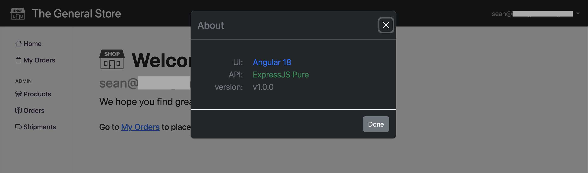

# SPA Stack Demo

> Note that everything is developed and operated from a `.devcontainer` docker image, while all of the dependent services are also hosted in docker ([flink-stack](https://github.com/seanhig/flink-stack) and [database-stack, kafka-stack](https://github.com/seanhig/database-stack)).

1. Start the `backend`:

```
dotnet run
```


2. Start the `frontend`

```
npm start
```


3. Browse to `http://localhost:4200`, the welcome page of `The General Store`.


4. Select the `sign in` link and we are presented with our OIDC options.


5. We select `Google` and complete the normal google authentication flow, selecting to `Continue` (whatever we named the app in our OIDC registration). Once authenticated, we are greeted and presented with new options. 


6.  Browse to the `My Orders` link.  From here we can place a web order on to the Kafka topic.


7. Start the `weborder-processor` docker container (from the [flink-stack]()).


8. Using the __Place an Order__ form, select a product and enter a quantity.  Enter anything for a destination, and place the order.  


A confirmation will be displayed that the order was placed.


9. Note in `conduktor` that we have a new Kafak message on the `weborders` topic.  The `weborder-processor` has already processed the order.


10. We can see in our `My Orders` list that the new order has been registered in the `backend MySQL and Postgres` databases.


11. The `About` dialog shows us we have been using the `.NET WebAPI backend`.


### Bonus

Just for fun we can switch the backend to `ExpressJS` and do it again.  All `backends` have feature parity and support the same service contract.


